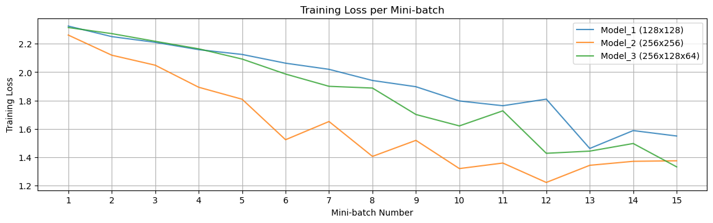
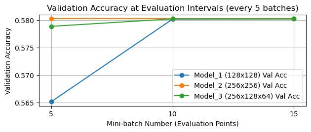

# Internal Report: Music Decade Classification (Part 1 & 2) - REVISED

This report documents the initial steps for the Million Song Dataset Classification assignment, covering data acquisition, problem definition, and initial model architecture exploration. This revised version includes results using seeding for reproducibility and intermediate validation checks.

## Part 1: Data Acquisition and Problem Definition (5 points)

### 1. Data Acquisition

*   The YearPredictionMSD subset was downloaded from the UCI Machine Learning Repository.
*   The dataset contains 515,345 instances, each with 90 numeric audio features and a target variable representing the song's release year.

### 2. Classification Problem Definition

*   **Task Conversion:** The original regression problem (predicting the exact year) was converted into a multi-class classification task.
*   **Decade Binning:** The release years (ranging from 1922 to 2011) were binned into 10 musical decades:
    *   1920s (Label 0)
    *   1930s (Label 1)
    *   1940s (Label 2)
    *   1950s (Label 3)
    *   1960s (Label 4)
    *   1970s (Label 5)
    *   1980s (Label 6)
    *   1990s (Label 7)
    *   2000s (Label 8)
    *   2010s (Label 9)
    *   Years before 1920 were mapped to the '1920s' bin (Label 0).
*   **Dataset Labeling:** The dataset was successfully labeled with these decade categories (0-9). The distribution of labels shows a significant imbalance, with most songs coming from the 1990s and 2000s:
    ```
    Value counts for Decade Labels:
    Decade_Label
    0       224
    1       252
    2       356
    3      3102
    4     11739
    5     24745
    6     41814
    7    124713
    8    299003
    9      9397
    Name: count, dtype: int64
    ```
*   **Data Splitting:** The dataset was split into training (70%), validation (15%), and test (15%) sets using stratified sampling based on the decade label (seed=42). This ensures that the class distribution is approximately preserved across the splits.
    *   Train shape: (372336, 90), y=(372336,)
    *   Validation shape: (71504, 90), y=(71504,)
    *   Test shape: (71505, 90), y=(71505,)
*   **Preprocessing:** Features were scaled using `StandardScaler`, fitted *only* on the training data and then applied to all three sets. The processed datasets were saved as PyTorch tensors.

## Part 2: Model Architecture Exploration (5 points)

### 1. DNN Architectures Designed

Three distinct DNN architectures were designed to explore different configurations:

*   **Model_1 (Moderate, Consistent):** A baseline model with 2 hidden layers of moderate, consistent width.
    *   Structure: `Input(90) -> Linear(128) -> ReLU -> Linear(128) -> ReLU -> Linear(10)`
    *   Reasoning: Establish a simple baseline performance with a standard feed-forward structure.
    *   Parameters: 29,450

*   **Model_2 (Wider Layers):** A model with 2 hidden layers, but significantly wider than Model 1.
    *   Structure: `Input(90) -> Linear(256) -> ReLU -> Linear(256) -> ReLU -> Linear(10)`
    *   Reasoning: Explore if increasing layer capacity (more neurons) allows the model to capture more complex feature interactions.
    *   Parameters: 91,658

*   **Model_3 (Deeper/Mixed):** A model with 3 hidden layers, starting wide and becoming narrower (bottleneck).
    *   Structure: `Input(90) -> Linear(256) -> ReLU -> Linear(128) -> ReLU -> Linear(64) -> ReLU -> Linear(10)`
    *   Reasoning: Investigate the effect of increased depth and a hierarchical feature extraction approach.
    *   Parameters: 65,098

### 2. Implementation and Initial Runs (15 Mini-batches)

*   **Implementation:** Each architecture was implemented using PyTorch (`nn.Module`). Seeding (seed=42) was used for reproducibility.
*   **Training Setup:**
    *   Batch Size: 128
    *   Optimizer: Adam (learning rate = 0.001)
    *   Loss Function: CrossEntropyLoss
    *   Device: MPS (Apple Silicon GPU)
*   **Procedure:** Each model was trained for exactly 15 mini-batches on the training set. Training loss was recorded after each mini-batch. Validation loss and accuracy were calculated on the full validation set every 5 batches (at batches 5, 10, and 15).

### 3. Performance Comparison & Selection

*   **Learning Trajectories (Training Loss & Validation Accuracy):**
    *   The plots below show the training loss per mini-batch and the validation accuracy at evaluation intervals (5, 10, 15 batches).

    <div style="text-align: center; margin: 2em 0;">
        
        <br>
        
    </div>

    *   **Observations:**
        *   Training loss decreased for all models, with Model 2 showing generally the lowest loss.
        *   Validation accuracy showed a very early plateau. Model 2 reached 0.5802 accuracy by batch 5, while Models 1 and 3 reached it by batch 10. None improved beyond this accuracy by batch 15.
        *   Validation loss consistently decreased for all models across the evaluation points, with Model 2 achieving the lowest values at each point (Batch 5: 1.65, Batch 10: 1.34, Batch 15: 1.27).

*   **Validation Performance Summary (After 15 Mini-batches):**

    ```
    --- Summary of Initial Runs (Performance after 15 Mini-batches) ---
    Architecture              | Final Val Loss  | Final Val Accuracy | Training Time (s)
    --------------------------------------------------------------------------------
    Model_1 (128x128)         | 1.4841          | 0.5802             | 1.53
    Model_2 (256x256)         | 1.2711          | 0.5802             | 1.40
    Model_3 (256x128x64)      | 1.3519          | 0.5802             | 1.47
    ```

*   **Selection:** While all models achieved the same final validation accuracy (0.5802) after 15 batches, **Model_2 (256x256)** is selected as the best-performing architecture for further optimization.
    *   **Reasoning:** Model 2 reached the peak validation accuracy earliest (by batch 5) and consistently maintained the lowest validation loss throughout the 15 batches, suggesting faster and potentially more stable initial convergence compared to the other architectures under these conditions. The early performance plateau highlights the need for further optimization, particularly learning rate tuning.

### 4. Visualizations

*   **Model Architectures (Text Descriptions):**

    *   **Model_1:**
        ```
        Model Architecture: Model_1
          (layer_1): Linear(in_features=90, out_features=128, bias=True)
          (relu_1): ReLU()
          (layer_2): Linear(in_features=128, out_features=128, bias=True)
          (relu_2): ReLU()
          (output_layer): Linear(in_features=128, out_features=10, bias=True)
        Total Trainable Parameters: 29,450
        ```
    *   **Model_2:**
        ```
        Model Architecture: Model_2
          (layer_1): Linear(in_features=90, out_features=256, bias=True)
          (relu_1): ReLU()
          (layer_2): Linear(in_features=256, out_features=256, bias=True)
          (relu_2): ReLU()
          (output_layer): Linear(in_features=256, out_features=10, bias=True)
        Total Trainable Parameters: 91,658
        ```
    *   **Model_3:**
        ```
        Model Architecture: Model_3
          (layer_1): Linear(in_features=90, out_features=256, bias=True)
          (relu_1): ReLU()
          (layer_2): Linear(in_features=256, out_features=128, bias=True)
          (relu_2): ReLU()
          (layer_3): Linear(in_features=128, out_features=64, bias=True)
          (relu_3): ReLU()
          (output_layer): Linear(in_features=64, out_features=10, bias=True)
        Total Trainable Parameters: 65,098
        ```

*   **Performance Plot:** *[Refer to the combined plot embedded in section 3]*

--- End of Report ---